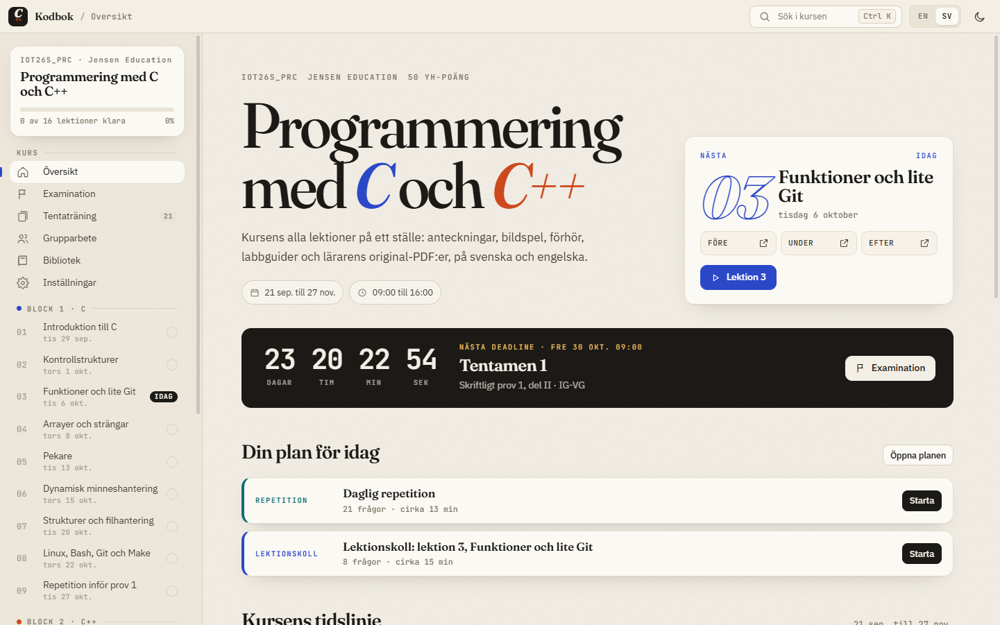
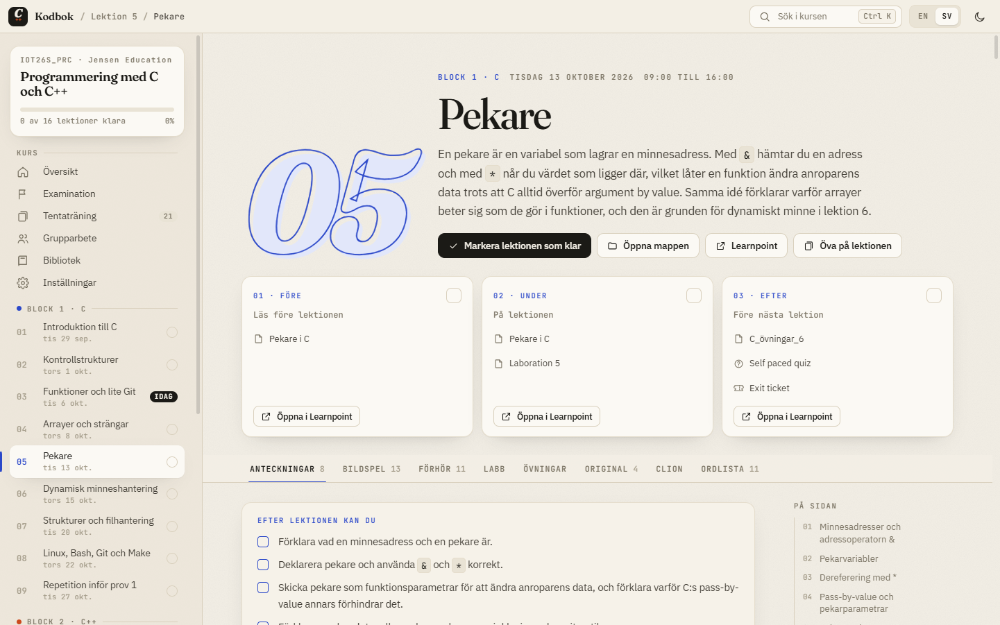
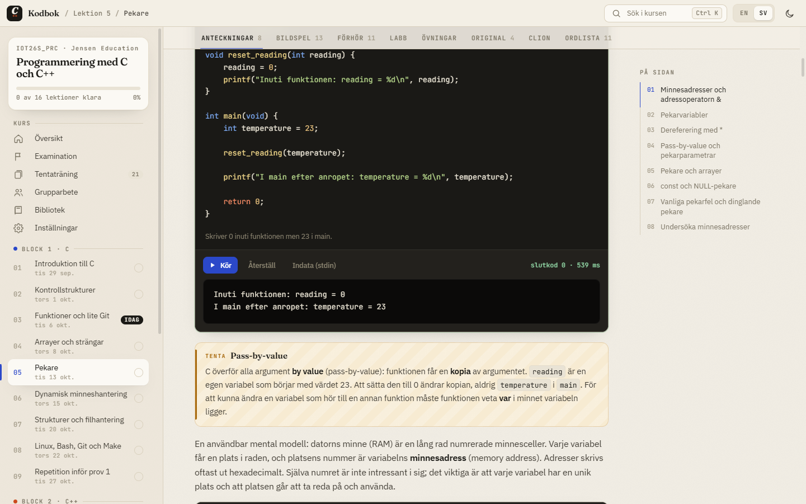
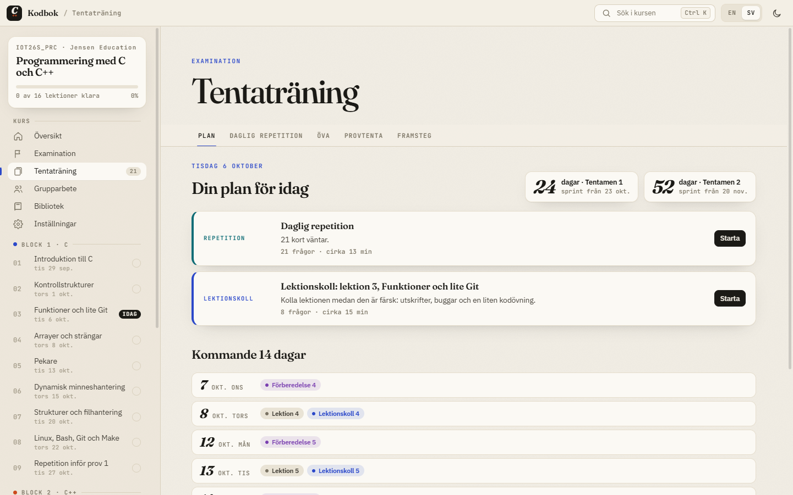
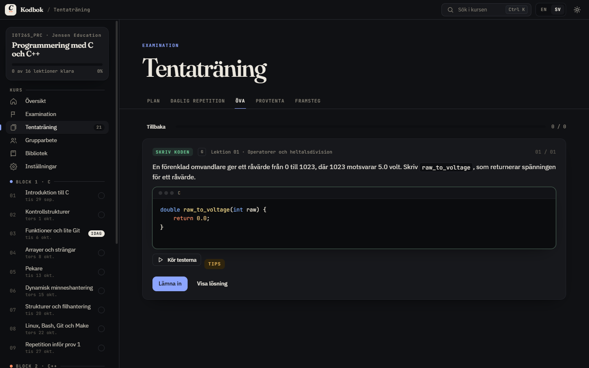
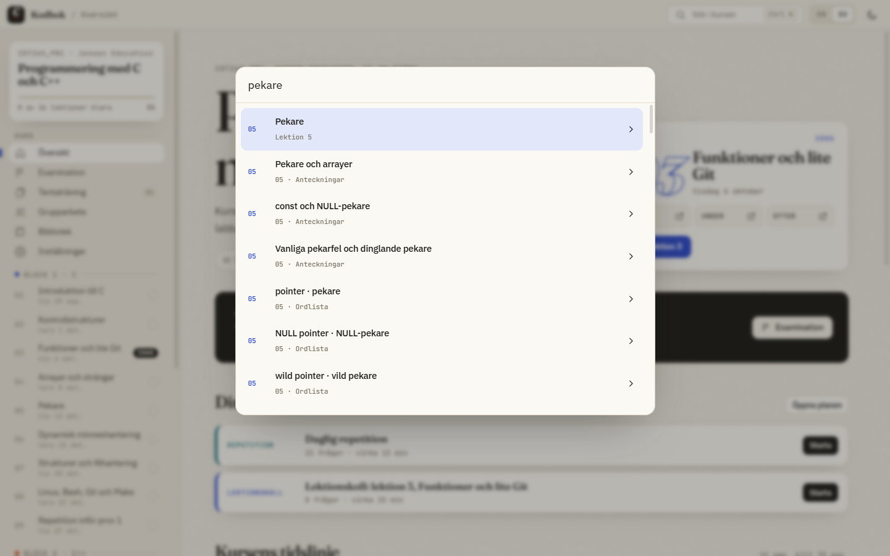
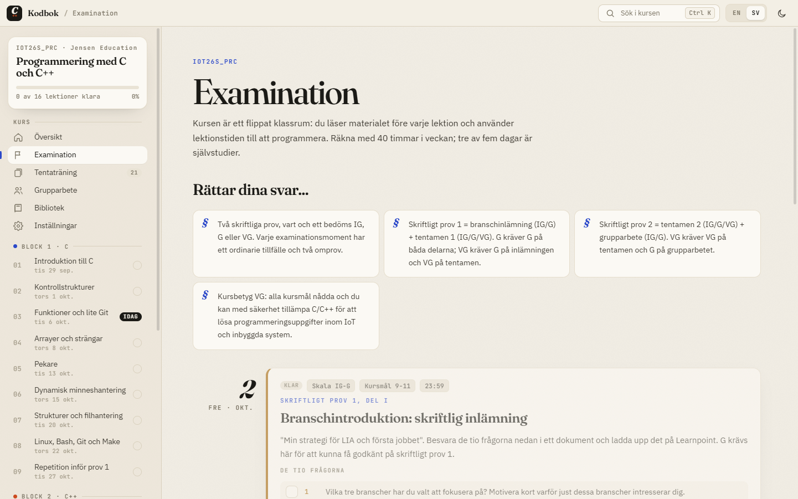
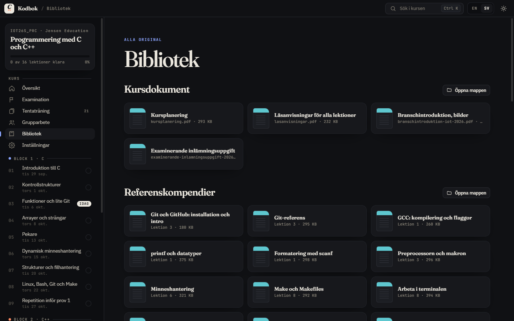

# Kodbok

Kodbok är en studieapp för kursen Programmering med C och C++ (IOT26S, Jensen Education). Hela kursen ligger i ett och samma fönster: anteckningar, bildspel, förhör, labbar, övningar, lärarens PDF:er och tentaträning. Appen finns på svenska och engelska och har ljust och mörkt läge.

## Ladda ner

### Windows

[Ladda ner Kodbok för Windows](https://github.com/Ahmedghanafer/kodbok/releases/latest/download/Kodbok-Setup.exe)

1. Kör `Kodbok-Setup.exe`. Installationen tar några sekunder och kräver inga administratörsrättigheter.
2. Windows kan visa rutan "Windows skyddade din dator" eftersom appen inte är signerad. Välj "Mer information" och sedan "Kör ändå".
3. Kodbok startar av sig själv och lägger en genväg på skrivbordet och i Startmenyn.

Appen uppdaterar sig själv. Den letar efter nya versioner när den startar, laddar ner dem i bakgrunden och installerar dem nästa gång du öppnar den. Du kan också trycka på "Sök efter uppdateringar" under Inställningar.

### Mac

[Ladda ner Kodbok för Mac](https://github.com/Ahmedghanafer/kodbok/releases/latest/download/Kodbok.dmg)

Fungerar på både Apple Silicon och Intel.

1. Öppna `Kodbok.dmg` och dra Kodbok till mappen Program.
2. Öppna Kodbok. Första gången säger macOS att appen inte kan verifieras eftersom den inte är signerad. Tryck på "Klar".
3. Gå till Systeminställningar, Integritet och säkerhet, bläddra ner och tryck på "Öppna ändå" bredvid Kodbok. Det behövs bara en gång.

På Mac säger appen till när det finns en ny version och ger dig en knapp som laddar ner den. Dra den nya versionen till Program så ersätts den gamla.

För att köra kod i appen behövs Apples kommandoradsverktyg. Installera dem genom att skriva `xcode-select --install` i Terminal.

## Vad du får

### Varje lektion på en sida

Varje lektion har anteckningar som förklarar ämnet från grunden, ett bildspel, förhörsfrågor, labben, övningarna, en ordlista och lärarens original. Överst ser du vad du ska göra före, under och efter lektionen, och du bockar av stegen allt eftersom.

### Kör koden direkt i anteckningarna

Kodexemplen går att köra och ändra utan att lämna sidan. Tryck på Kör och se utskriften under koden. Det kräver en kompilator på datorn. På Windows fungerar MSYS2 eller den MinGW som följer med CLion, på Mac Apples kommandoradsverktyg. Kodbok hittar den själv.

### Tentaträning med en plan

Kodbok lägger upp en plan fram till varje tenta. Varje dag får du en kort repetition av det du håller på att glömma och en lektionskoll på det senaste du läst. Du ser hur många dagar som är kvar och vad som väntar de kommande två veckorna.

### Frågor av samma slag som på tentan

Öva på en lektion, en vecka eller ett helt block. Frågorna finns i sex typer: vad skrivs ut, hitta felet, skriv koden, sant eller falskt, flerval och förklara. Kodfrågor rättas genom att din kod kompileras och testas på riktigt. Det finns också en provtenta på tid.

### Sök i hela kursen

Tryck Ctrl K och sök i anteckningar, ordlistor och alla PDF:er på en gång.

### Examination och deadlines

En sida samlar betygskriterier, inlämningar och tentor med datum och nedräkning. Om du vill påminner Kodbok dig med aviseringar tre dagar, en dag och tre timmar före en deadline, och kvällen före varje lektion.

### Bibliotek

Kursdokument, referenskompendier, extraövningar och böcker ligger samlade och öppnas direkt i appen.

### Mer

- Öppna en labb eller övning som ett färdigt projekt i CLion med ett klick.
- Logga in på Learnpoint i appen så hämtar Kodbok nytt material när läraren publicerar det.
- Dina framsteg sparas på din egen dator.

## Bra att veta

Kodbok är ett studentprojekt och inte en officiell produkt från Jensen Education. Appen finns för Windows 10 och 11 (64 bitar) och för macOS 12 eller senare.

Hittar du ett fel eller saknar du något? Skriv i Discord eller öppna ett [ärende](https://github.com/Ahmedghanafer/kodbok/issues).
